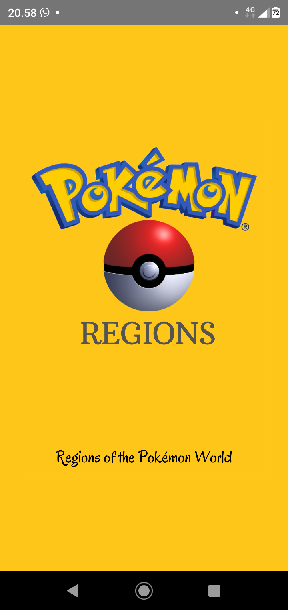
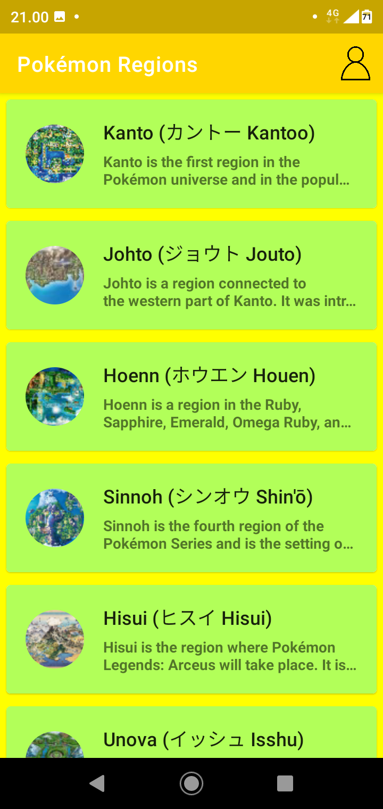
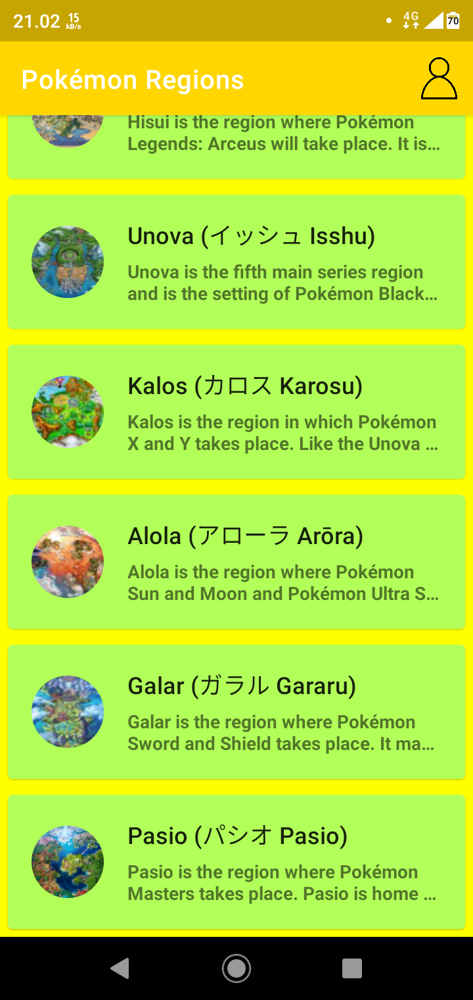
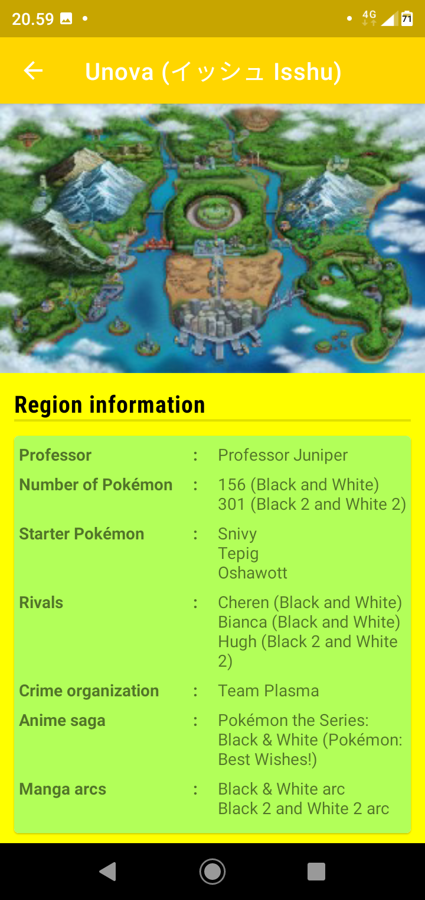
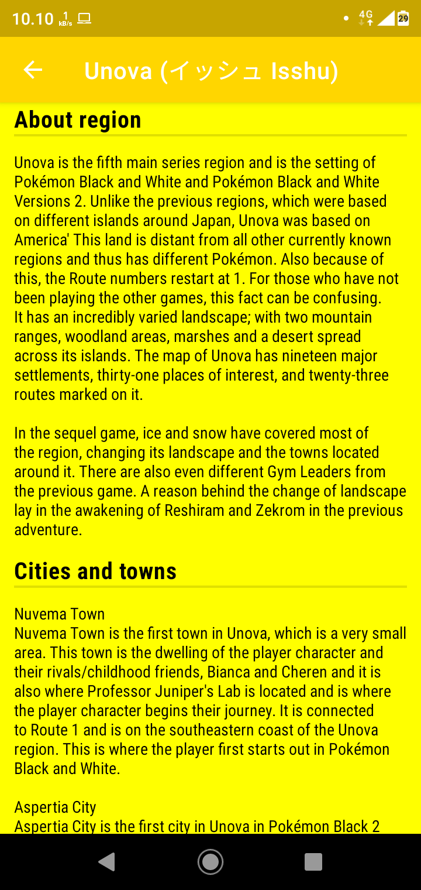
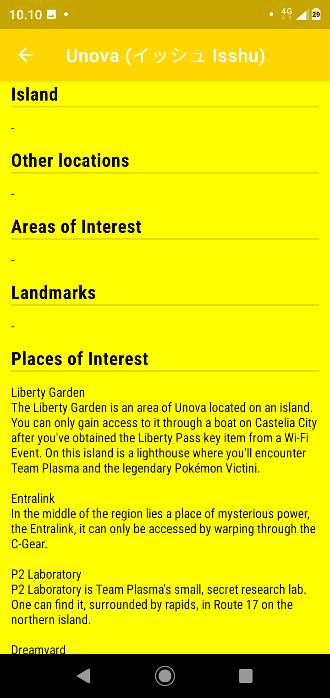
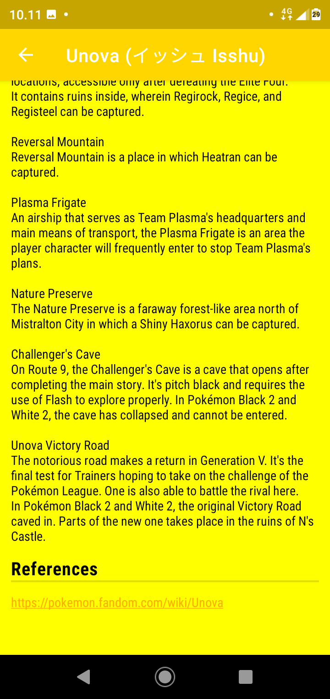
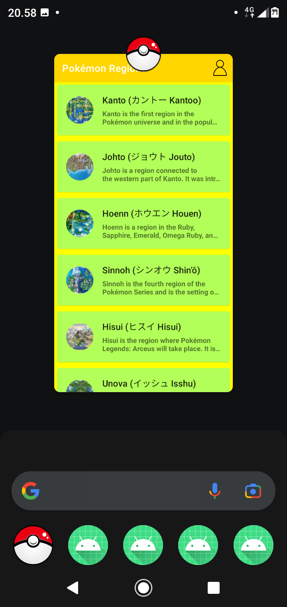
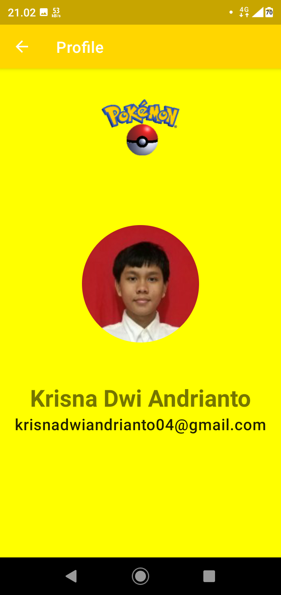

# simple-recyclerview-app
An application that uses RecyclerView

https://www.dicoding.com/academies/51

Download this app: https://cloud.degoo.com/share/fErVfK78sNArvqVcHoU7Mg

## Screenshots
&nbsp;&nbsp;&nbsp;
&nbsp;&nbsp;&nbsp;
&nbsp;&nbsp;&nbsp;

&nbsp;&nbsp;&nbsp;
&nbsp;&nbsp;&nbsp;
&nbsp;&nbsp;&nbsp;

&nbsp;&nbsp;&nbsp;
&nbsp;&nbsp;&nbsp;
&nbsp;&nbsp;&nbsp;
